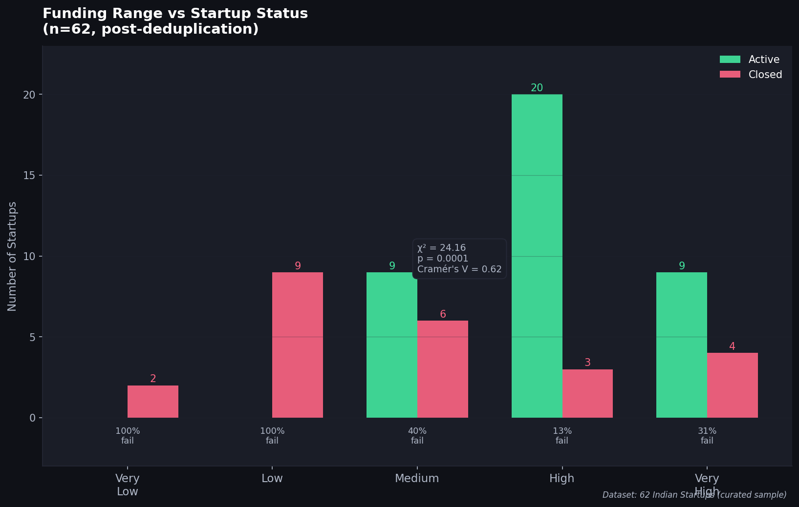
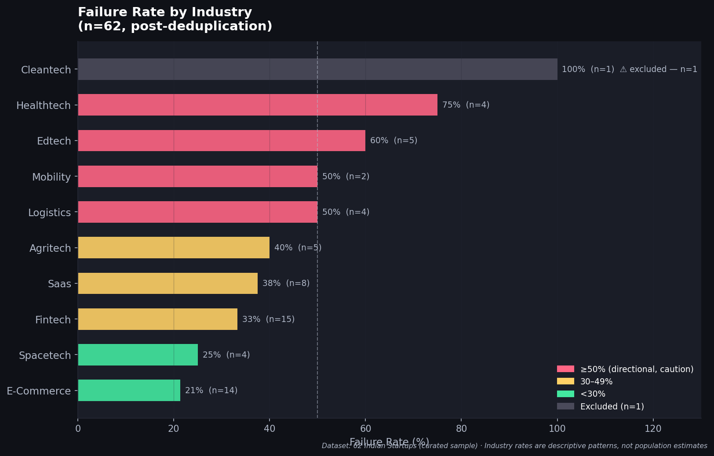
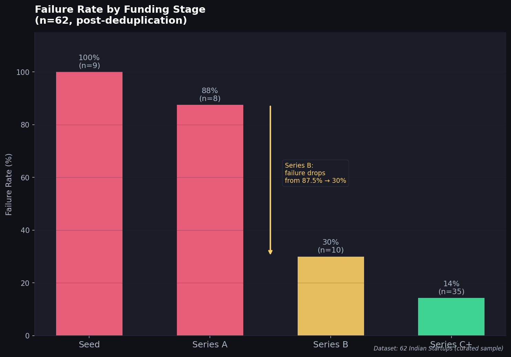

# **Indian Startup Survival Analysis** 

## **Overview** 

Every year, hundreds of startups shut down despite raising funding, attracting customers, and building strong teams. 

This project began with a simple question: 

#### **What separates startups that survive from those that fail?** 

To explore that question, I built a dataset of 62 Indian startups across multiple industries, funding stages, and outcomes. Using Python, statistical testing, and exploratory data analysis, I examined how factors such as funding level, funding stage, industry, and unicorn status relate to startup survival outcomes. 

The goal was not to predict success, but to identify measurable patterns associated with survival and failure. 

## **Research Question** 

**What startup characteristics are most strongly associated with failure and survival outcomes among Indian startups?** 

### **Hypothesis** 

Funding level and industry characteristics are associated with startup survival outcomes in India, with lower-funded startups exhibiting higher failure rates than heavily funded startups. 

## **Dataset** 

The dataset contains 62 Indian startups (post-deduplication) founded between 2012 and 2023. 

### **Variables Included** 

- Startup Name 

- Founded Year 

- Industry 

- Funding Range 

- Funding Stage 

- Startup Status (Active / Closed) 

- Unicorn Status 

- Outcome Category 

- Survival Years 

The dataset was manually curated using publicly available startup information. 

1 

## **Tools & Technologies** 

- Python • Pandas • NumPy • Matplotlib • Seaborn • SciPy • Excel 

## **Methodology** 

The analysis was completed in four stages: 

### **1. Data Collection & Cleaning** 

- Compiled startup information from public sources 

- Removed duplicate records 

- Standardized categorical variables 

- Encoded funding ranges for statistical analysis 

### **2. Exploratory Data Analysis** 

- Industry distribution 

- Funding distribution 

- Startup status analysis 

- Unicorn analysis 

- Survival year analysis 

### **3. Statistical Analysis** 

The following statistical methods were used: 

- Point-Biserial Correlation 

- Chi-Square Test of Independence 

- Cramér's V 

- Mann-Whitney U Test 

- Kruskal-Wallis Test 

### **4. Interpretation & Business Insights** 

Findings were translated into practical implications for founders, investors, and business decisionmakers. 

2 

## **Key Findings** 

### **Funding Matters** 

Funding level showed the strongest measurable relationship with startup survival. 

- Chi-Square = 24.16 • p-value = 0.0001 • Cramér's V = 0.62 

This indicates a strong association between funding level and survival outcomes within the sample. 

### **Series B Appears to Be a Major Survival Milestone** 

Failure rates declined sharply as startups progressed through funding stages: 

|Stage|Failure Rate|
|---|---|
|Seed|100.0%|
|Series A|87.5%|
|Series B|30.0%|
|Series C+|14.3%|


The transition from Series A to Series B was the most significant drop observed in the dataset. 

### **Capital Alone Does Not Guarantee Success** 

Several heavily funded startups still failed despite raising substantial capital. 

Examples include: 

- Builder.ai • Dunzo • The Good Glamm Group • BlueSmart 

This suggests that access to capital improves survival odds but cannot compensate for weaknesses in execution, governance, or business model design. 

### **Fintech: High Risk, High Reward** 

Fintech was the largest sector in the dataset. 

3 

It produced: 

- Multiple startup failures 

- Multiple unicorns 

This combination makes it one of the most competitive and outcome-diverse sectors in the sample. 

## **Project Structure** 

```
indian-startup-survival-analysis/
│
├── data/
│   └── startup_dataset.csv
│
├── notebooks/
│   └── indian_startup_analysis.ipynb
│
├── visuals/
│   └── charts/
│
├── report/
│   └── Report.pdf
│
└── README.md
```

## **Files** 

### **Notebook** 

Contains the complete Python workflow: 

- Data cleaning 

- Exploratory analysis 

- Statistical testing 

- Visualizations 

### **Report** 

Contains the full analytical report, findings, hypothesis evaluation, and business recommendations. 

## **Limitations** 

- The dataset represents a curated sample of Indian startups and is not intended to represent the entire startup ecosystem. 

- Certain industries contain relatively small sample sizes. 

4 


## Key Visualizations

### 1. Funding Range vs Startup Status

This visualization compares startup outcomes across different funding ranges and directly supports the project's primary hypothesis.



---

### 2. Failure Rate by Industry

Failure rates vary considerably across industries, highlighting that sector characteristics also influence startup outcomes.



---

### 3. Funding Stage vs Failure Rate

The analysis shows that failure rates decline substantially after startups progress beyond the early funding stages, with Series B representing an important survival milestone.


